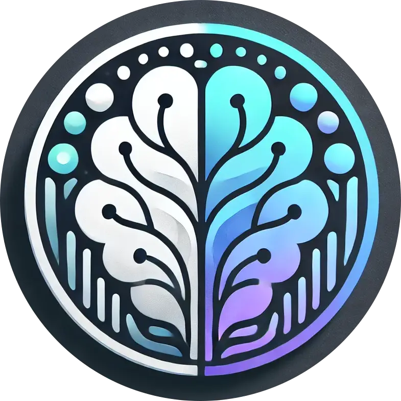

<div align="center">
  

  # SoulSync AI

  A Next.js-powered mental health chatbot application providing AI-assisted emotional support and wellness tracking.

  [](https://soulsyncai.netlify.app/)
  [](https://nextjs.org/)
  [](https://reactjs.org/)
  [](https://www.typescriptlang.org/)
  [](https://tailwindcss.com/)
</div>

## ✨ Features

- 🤖 Advanced AI-powered chat interface
- 🎭 Real-time sentiment analysis
- 📊 Mood tracking and visualization
- 🌓 Dark/Light theme support
- 🔐 Secure authentication (Email/Password & Google OAuth)
- 📱 Fully responsive design
- ♿ Accessible components through Radix UI

## 🚀 Quick Start

1. **Clone and Install**
```bash
git clone <repository-url>
cd soulsync_frontend
npm install
```

2. **Set up Environment Variables**
Create a `.env.local` file with:
```env
NEXT_PUBLIC_APPWRITE_API_ENDPOINT=
NEXT_PUBLIC_APPWRITE_PROJECT_ID=
NEXT_PUBLIC_APPWRITE_DB_ID=
NEXT_PUBLIC_APPWRITE_USERS_COLLECTION_ID=
NEXT_PUBLIC_SOULSYNC_BASE_URL=
NEXT_PUBLIC_APPWRITE_REDIRECT_URL=
NEXT_PUBLIC_APPWRITE_FAILURE_URL=
NEXT_PUBLIC_OPENROUTER_API_KEY=
NEXT_PUBLIC_HUGGINGFACE_API_KEY=
```

3. **Run Development Server**
```bash
npm run dev
```

Open [http://localhost:3000](http://localhost:3000) to view the application.

## 🛠️ Tech Stack

- **Framework**: Next.js 15.2.2
- **Language**: TypeScript
- **Styling**: TailwindCSS, SASS
- **UI Components**: 
  - Shadcn UI
  - Radix UI
  - Spline Design (3D elements)
- **State Management**: React Hooks
- **Backend Services**: Appwrite
- **APIs**: 
  - OpenRouter (AI model)
  - HuggingFace (Sentiment analysis)

## 🏗️ Project Structure

```
src/
├── app/          # Next.js app router pages
├── components/   # Reusable UI components
├── hooks/        # Custom React hooks
├── interface/    # TypeScript interfaces
├── lib/          # Utility functions
├── service/      # API services
└── utils/        # Helper utilities
```

## 🔒 Security Features

- OAuth 2.0 implementation
- Secure token handling
- Protected routes
- Environment variable security
- API key protection
- User data encryption

## 📊 Key Components

1. **Chat System**
   - Real-time AI interactions
   - Message history storage
   - Sentiment analysis integration
   - Chat filtering and organization

2. **Authentication**
   - Multiple auth providers
   - Session management
   - Profile management

3. **Analytics**
   - Mood tracking
   - Sentiment visualization
   - Historical trends

## 🧪 Running Tests

```bash
npm run test
```

## 📦 Build for Production

```bash
npm run build
```

## 🚀 Deployment

The application is deployed on Netlify. Automated deployments are triggered on main branch updates.

Live demo: [https://soulsyncai.netlify.app/](https://soulsyncai.netlify.app/)

## 🤝 Contributing

1. Fork the repository
2. Create your feature branch (`git checkout -b feature/AmazingFeature`)
3. Commit your changes (`git commit -m 'Add some AmazingFeature'`)
4. Push to the branch (`git push origin feature/AmazingFeature`)
5. Open a Pull Request

## 📝 License

This project is licensed under the MIT License - see the [LICENSE](LICENSE) file for details.

## 🙏 Acknowledgments

- [Next.js](https://nextjs.org/)
- [Shadcn UI](https://ui.shadcn.com/)
- [Appwrite](https://appwrite.io/)
- [OpenRouter](https://openrouter.ai/)
- [HuggingFace](https://huggingface.co/)

---

<div align="center">
Made with ❤️ by the SoulSync Team
</div>
